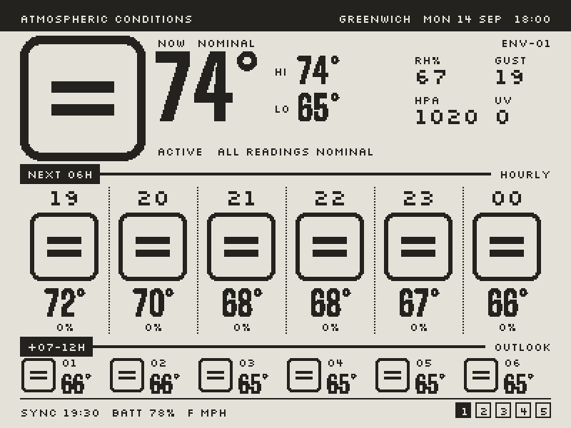
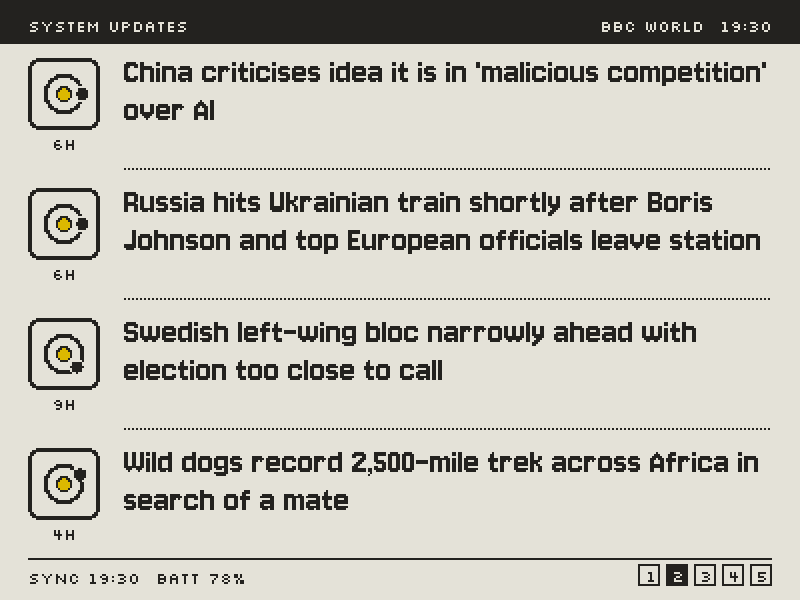
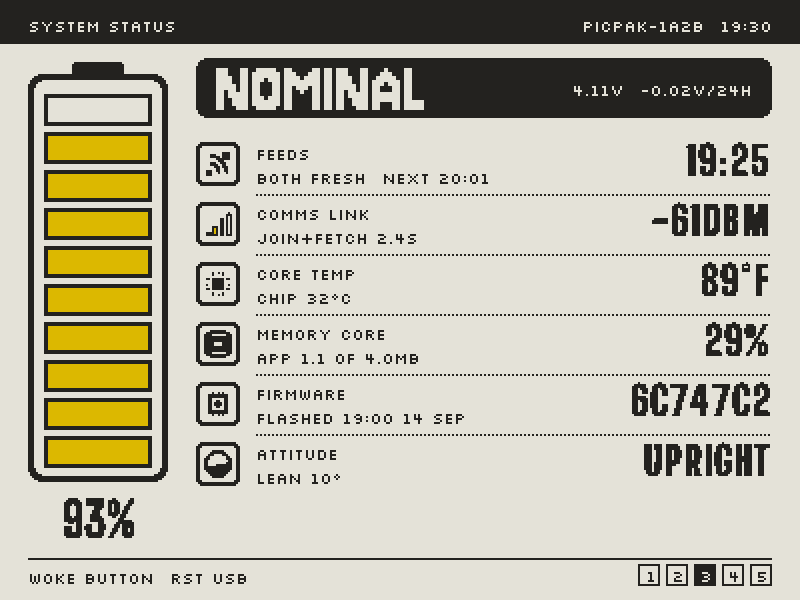
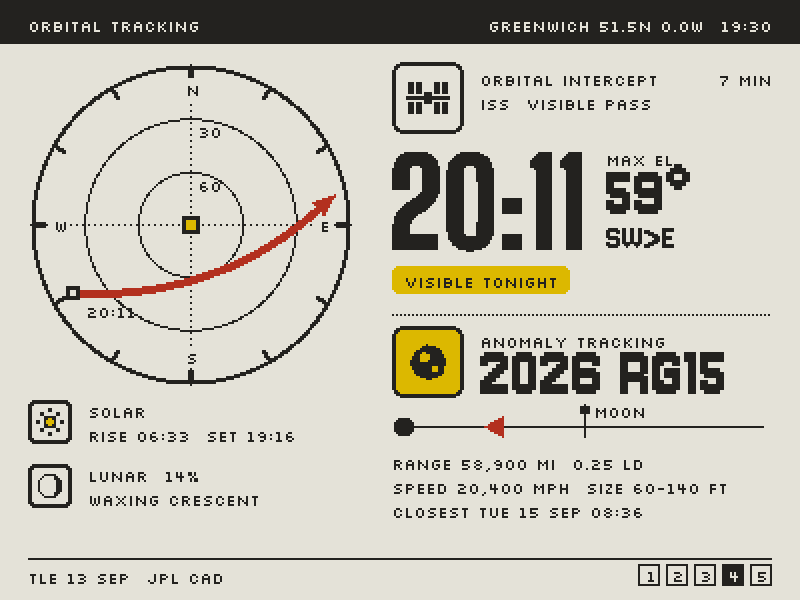
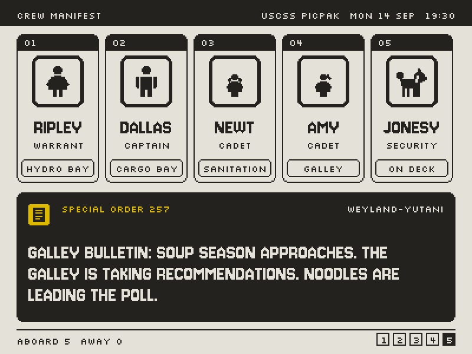

# Semiotic

Open firmware for the PicPak, a 4.2" four-colour e-ink frame built on an ESP32-C3. The stock firmware is a Bluetooth photo frame driven from a phone app. This turns it into a small ship's console in the visual language of Ron Cobb's semiotic standard for *Alien*: five screens stepped through with the one button, Wi-Fi once an hour, deep sleep in between.

<table>
<tr>
<td></td>
<td></td>
</tr>
<tr>
<td></td>
<td></td>
</tr>
<tr>
<td></td>
<td></td>
</tr>
</table>

| Mode | What it shows | Data |
|---|---|---|
| 1 Atmospheric Conditions | Temperature, humidity, gusts, pressure and UV now, hazard placards for the next six hours, and a strip for hours seven to twelve | [Open-Meteo](https://open-meteo.com), hourly |
| 2 System Updates | Four headlines from any RSS feed, each with an orbit placard that shows its age | RSS, hourly |
| 3 System Status | Battery and its trend over a day, feed health, Wi-Fi signal, chip temperature, storage, firmware build, which way up the frame is | the board itself |
| 4 Orbital Tracking | The next visible ISS pass on a sky scope, the nearest asteroid this week, sunrise, sunset and moon phase | [CelesTrak](https://celestrak.org) and [JPL](https://ssd-api.jpl.nasa.gov/doc/cad.html), every six hours; passes are computed on the board |
| 5 Crew Manifest | Your household as a ship's crew, with each person's status from a daily schedule, a rotating duty roster, and a Special Order for every day of the year | your settings |

## Read This First

Flashing this firmware replaces the stock firmware, and it overwrites the flash region where the PicPak keeps its serial number and radio calibration. The backup you make in the quick start is the only copy of that data. Make it, check that both reads match, and keep it somewhere safe.

- **Tested on one unit.** It was built and tested on a single PicPak running stock firmware `simplestick` V0.3.2. A different hardware revision or a newer stock firmware may behave differently, or may have locked the chip.
- **The way back is written but not rehearsed.** `make restore` checks your backup and writes it back through the chip's ROM loader, but nobody has run it end to end on a PicPak yet.
- **Not affiliated with the maker of the PicPak.** You do this at your own risk.

## What You Need

- A PicPak 4.2" frame. On USB it shows up as an Espressif device (vendor `0x303A`, product `0x1001`), and `make board-info` should report an ESP32-C3.
- A USB-C cable that carries data, not only power.
- macOS or Linux. Everything was developed on macOS. The Makefile uses `/dev/ttyACM*` ports on Linux, which should work but has not been tried. Windows is not supported.
- [ESP-IDF v5.5](https://docs.espressif.com/projects/esp-idf/en/v5.5/esp32c3/get-started/), the Espressif toolchain. Tested with v5.5.5.
- A 2.4 GHz Wi-Fi network with a WPA2 or WPA3 password. The frame cannot join 5 GHz networks, captive portals or enterprise logins.

## Quick Start

1. **Install ESP-IDF v5.5.** The Makefile looks for it in `~/esp/esp-idf-v5.5.5`; anywhere else works if you pass `IDF_PATH=/your/path` to `make`. ESP-IDF 5.5 needs Python 3.9 to 3.13.

   ```sh
   mkdir -p ~/esp && cd ~/esp
   git clone -b v5.5.5 --recursive https://github.com/espressif/esp-idf.git esp-idf-v5.5.5
   cd esp-idf-v5.5.5 && ./install.sh esp32c3
   ```

2. **Get the firmware.**

   ```sh
   git clone https://github.com/kohlhofer/picpak-semiotic.git
   cd picpak-semiotic
   ```

3. **Make your settings file** and fill in at least your Wi-Fi and location. [Configure](#configure) explains every setting.

   ```sh
   make config
   open firmware/main/config.h    # or any text editor
   ```

4. **Check the board.** The stock firmware sleeps, and its USB port disappears while it does, so hold the frame's button while you plug it in and keep holding it until the command connects.

   ```sh
   make board-info
   ```

   Look for `ESP32-C3` in the chip line, and in the eFuse summary for `SECURE_BOOT_EN` set to `False` and `SPI_BOOT_CRYPT_CNT` set to `0`. If secure boot or flash encryption is on, stop here: this firmware cannot run on that unit.

5. **Back up the stock firmware.** Plug in with the button held again. This reads the lower 16 MB of flash twice, which takes about 20 minutes, and stops with an error if the two reads differ.

   ```sh
   make backup
   ```

   The result is in `backup/`: two images, their `SHA256SUMS` and the eFuse summary. Copy that folder somewhere other than this computer. The images belong to your unit alone, and git ignores the folder.

6. **Build and flash.**

   ```sh
   make flash
   ```

   This builds, then waits up to 15 minutes for the board to be awake and flashes it as soon as it is. Plug in with the button held, or just plug in and wait.

7. **Watch it start.** After flashing, the frame joins your Wi-Fi, fetches the forecast, headlines and orbit data, and draws the weather. That takes about a minute, 16 seconds of it the panel refresh. Press the button to step to the next screen. `make log` shows what the board is doing, and follows it through sleep.

## Configure

All settings live in `firmware/main/config.h`, which `make config` copies from [`config.example.h`](firmware/main/config.example.h). Git ignores `config.h`, so your password and your family's names never end up in a commit. The build stops with a message if the file is missing or lacks a required setting.

| Setting | Needed | What it does |
|---|---|---|
| `WIFI_SSID`, `WIFI_PASSWORD` | Required | The network the frame joins once an hour |
| `PLACE_LAT`, `PLACE_LON` | Required | Where the weather, sunrise and sunset, and ISS passes are worked out for |
| `PLACE_NAME` | Recommended | The name in the headers, such as `"PORTLAND OR"` |
| `PLACE_ELEV_M` | Optional | Height above sea level in metres, for pass predictions; 0 is fine |
| `NEWS_URL`, `NEWS_LABEL` | Optional | The headline feed and its name; BBC News World by default |
| `CREW_CONFIG` | Optional | The Crew Manifest: ship, company, and up to six crew with their schedules |

### Wi-Fi

Set `WIFI_SSID` and `WIFI_PASSWORD` exactly as your network spells them. When the frame cannot connect it keeps showing its last data and tries again every 10 minutes, and System Status counts the failures. Each attempt keeps the radio on for up to 20 seconds, so a frame that lives away from a known network drains its battery faster.

### Location

Set `PLACE_LAT` and `PLACE_LON` in decimal degrees, north and east positive. Right-clicking a spot in most map apps shows them; two decimal places, about a kilometre, is enough. `PLACE_NAME` is only a label, so keep it short. The pixel fonts in the headers have capitals only, and the firmware converts it for you.

The time zone is not a setting. The weather service works it out from the coordinates, daylight saving included, and the board's clock is set from the server's time on every successful fetch. Until the first fetch after a reset, the orbit and crew screens say the clock is not set.

Units are fixed at imperial (°F, mph, inches, miles) with a 24-hour clock. Changing them means editing the request in `wx.c` and the hazard thresholds beside it.

### Headlines

System Updates reads any RSS 2.0 feed served over HTTPS whose items have a `<title>` and a `<pubDate>`, up to 48 KB. It shows the first four items that fit, in the order the feed lists them, and turns typographic quotes, dashes and accented letters into plain ASCII. Atom feeds are not supported.

```c
#define NEWS_URL   "https://feeds.bbci.co.uk/news/world/rss.xml"
#define NEWS_LABEL "BBC WORLD"
```

Try a feed on your computer before flashing it. `make preview MODE=2` downloads it, renders the screen to `build/preview.png` and prints each headline it found. The default is BBC News World because its headlines say what happened. NPR's top stories, the first choice, ran to features and teasers.

### Crew

The Crew Manifest shows up to six people and pets. Five fit comfortably; with six the cards narrow, and names, ranks and posts longer than about six letters get cut off. Each crew entry is one line in `CREW_CONFIG`:

```c
/* name     rank        figure     human  sleep from   sleep to    away        away from  away to    away days */
{ "RIPLEY", "WARRANT",  PI_WOMAN,  true,  HM(23, 0),   HM(6, 30),  "ON DUTY",  HM(9, 0),  HM(17, 0), CREW_WEEKDAYS },
{ "JONESY", "SECURITY", PI_DOG,    false, 0,           0,          NULL,       0,         0,          0 },
```

| Field | Meaning |
|---|---|
| name, rank | Shown on the card. Names up to 10 characters; six or fewer fit best |
| figure | `PI_MAN`, `PI_WOMAN`, `PI_GIRL1` (child with pigtails), `PI_GIRL2` (child with ponytail) or `PI_DOG` |
| human | `false` for a pet. Pets get no duty, and they keep watch whenever no human is up |
| sleep from, to | Local time as `HM(hour, minute)`. The window may wrap past midnight. The card shows HYPERSLEEP on a black placard |
| away | The word shown while away, such as `"ON DUTY"`, `"TRAINING"` or `"SHORE LEAVE"`, or `NULL` for never |
| away from, to, days | When that applies. `CREW_WEEKDAYS` is Monday to Friday; for other days build a mask with bit 0 as Sunday, so `(1 << 1) \| (1 << 3)` is Monday and Wednesday |

Above the list, `.ship` and `.company` appear in the header and on the order plate, `.duty` turns on the daily rotation of posts (galley, hydro bay, cargo bay, sanitation) among the humans, and `.sleep` turns hypersleep on. Anyone who is neither asleep nor away shows their post for the day, or ON DECK when duties are off.

### Special Orders

Every day the crew screen shows one of 366 Special Orders from [`firmware/orders.txt`](firmware/orders.txt), numbered by the day of the year. They are written as cheerful corporate memos for a family: water, bedtime, pancakes, the moon. Edit any line, keeping the `NNN|` prefix, then run `make orders`. It checks every line (capitals and punctuation the font has, 60 to 130 characters) and regenerates `orders_gen.c`. Three tokens are filled in on the board: `{DOG}` with the first pet's name, `{SHIP}` and `{CO}` with the ship and company. `make test` confirms every order fits the plate.

### Beyond config.h

- **The ISS** is catalogue number 25544 in `TLE_URL` in `orbit.h`; another satellite in low orbit works the same way. Passes count when the satellite climbs above 10° and is sunlit against a dark sky.
- **Which modes appear, and in what order**, is `MODES` and `do_draw` in `main.c`.
- **Refresh timing** is `sched_next_fetch` in `sched.c` (hourly) and `ORBIT_REFRESH_S` in `orbit.h` (six hours).

## Using It

- **Press** the button to step to the next screen. The panel takes 16 seconds to refresh, and presses during a refresh still count: two quick presses move two screens on, wrapping from the last back to the first.
- **Hold** the button for 3 seconds for maintenance mode. The LED blinks five times and the USB port stays up for flashing or logs. Hold 2 seconds to leave.
- **Hourly**, the board wakes, fetches and redraws whatever is on screen. With Orbital Tracking showing, it also wakes ten minutes before a visible ISS pass to show INTERCEPT IMMINENT, and again just after the pass ends.
- **The battery** is about 550 mAh. System Status shows its voltage and how that changed over the last day. Battery life is not measured yet.

`make log` prints the board's console for 30 seconds without resetting it (`DURATION=300` for longer), and keeps following it through sleep.

## Updating

Pull, then `make flash`. It waits for the board to wake on its own, which happens at least once an hour, or you can hold the button 3 seconds to flash right away. Your `config.h` and `backup/` are untouched by updates.

## Going Back to Stock

```sh
make restore
```

This checks `backup/stock_16mb_1.bin` against `backup/SHA256SUMS`, refuses anything that is not exactly 16 MB, and writes it back through the ROM loader. Expect 5 to 10 minutes that start with a silent erase. Only your own unit's backup is right for it: another unit's image carries the wrong serial number and radio calibration. This path has not yet been run end to end on a PicPak, so if you try it, an issue saying how it went would help the next person.

## Rules That Protect the Board

The tools here follow these for you. They matter if you reach for `esptool` yourself. The first three come from the [varanu5](https://github.com/varanu5/picpak-tesserae-client) project's testing, and I have not reproduced them. They are cheap to follow and expensive to learn.

- Never run `erase_flash`. A full erase of this flash chip is reported to fail partway.
- Never read or write above 16 MB. The chip reports 32 MB, but addresses above 16 MB wrap onto the bootloader.
- Use the ROM loader (`--no-stub`) for large reads and writes. The stub loader has corrupted big transfers on this board. Normal firmware flashes are small and verify their hash.
- The supply sags under load, so the firmware caps Wi-Fi transmit power at 10 dBm and turns the radio off before a panel refresh.
- Opening the USB serial port resets the chip unless RTS is released before DTR. `tools/log.py` does it in the right order.

## Development

| Command | What it does |
|---|---|
| `make test` | Host tests, no board needed: framebuffer, wake handling, forecast parsing and hazards, drawing, scheduling, RSS, status readouts, orbits checked against Skyfield, crew and orders |
| `make preview MODE=4` | Render one screen to `build/preview.png` with live data for your settings. `FORECAST=` and `NEWS=` take saved responses, `PREVIEW_NOW=` a time |
| `make screenshots` | Regenerate the images in `docs/` from the example settings and saved responses |
| `make assets` | Redraw placards and fonts from `tools/assets/rasterize.html` into `assets_gen.c`; needs Google Chrome |
| `make orders` | Check `firmware/orders.txt` and regenerate `orders_gen.c` |
| `make monitor` | Interactive console on an awake board |

The drawing code is plain C with no ESP-IDF dependency, so the preview tool renders every screen on your computer pixel for pixel as the panel will. Everything that touches hardware or the network stays in `main.c`, `net.c`, `epd.c`, `imu.c` and `keypin.c`.

| Path | Holds |
|---|---|
| `firmware/main/` | The firmware. `main.c` runs the wake loop and modes; `screen.c` draws the five screens |
| `firmware/main/sgp4.c`, `pass.c`, `sky.c` | Orbit propagation, pass prediction, Sun and Moon |
| `firmware/orders.txt` | The Special Orders |
| `test/` | Host tests and saved responses they run against |
| `tools/` | Preview renderer, backup, restore, flashing and log helpers, and the asset pipeline |
| `docs/` | README screenshots |
| `archive/sleep-test/` | The deep-sleep and wake test firmware from bring-up, kept for reference |

## Hardware Notes

| Part | Detail |
|---|---|
| SoC | ESP32-C3, single-core RISC-V, 400 KB RAM, no PSRAM |
| Flash | Macronix, reports 32 MB; the C3 addresses the lower 16 MB |
| Panel | 4.2" 400 × 300, black, white, yellow and red, UC81xx-class controller, full refresh about 16 s |
| IMU | ST LSM6DS3TR-C on SPI |
| Radios | 2.4 GHz Wi-Fi, Bluetooth LE 5 |
| Input and output | One button, one LED |
| Power | About 550 mAh Li-Po, USB-C charging, no charger-detect line |

| GPIO | Use |
|---|---|
| 6, 3, 4 | SPI SCLK, MOSI, MISO, shared by panel and IMU |
| 9, 8, 10, 20 | Panel CS, DC, RST, BUSY (low while busy) |
| 7, 5 | IMU CS, and the IMU's INT1 output, which can wake the C3 |
| 2 | Button to ground, and the battery voltage through a × 1.45 divider |
| 21 | LED, active-low |
| 18, 19 | Native USB serial/JTAG |

Pixels are 2 bits each, `0` black, `1` white, `2` yellow and `3` red, and the panel scans rows bottom to top. The stock firmware I replaced, `simplestick` V0.3.2, is a Bluetooth app with an AT-style command set, and its strings suggest a fridge mode that uses the IMU to catch a door opening. Its partition table put a 256 KB settings region at `0x9000`, two 1.5 MB app slots and 12 MB of photo storage at `0x350000`.

## Credits and Licence

- **[varanu5/picpak-tesserae-client](https://github.com/varanu5/picpak-tesserae-client)** reverse-engineered this hardware first. The pin map, the panel's init sequence and the flash-handling rules come from that project, which is AGPL-3.0-or-later.
- **Weather** from [Open-Meteo](https://open-meteo.com), whose data is CC BY 4.0 and free for non-commercial use.
- **Headlines** by default from [BBC News](https://www.bbc.co.uk/news) RSS, offered for personal, non-commercial use.
- **ISS orbital elements** from [CelesTrak](https://celestrak.org). **Close approaches** from NASA JPL's [SBDB Close-Approach Data API](https://ssd-api.jpl.nasa.gov/doc/cad.html).
- **Fonts** Jersey 10, Silkscreen and Big Shoulders Display, under the SIL Open Font License 1.1, are rasterised into the firmware as bitmaps. Their notices are in [`licenses/OFL-1.1.txt`](licenses/OFL-1.1.txt).
- **Test reference values** for orbits, sun and moon were generated with [Skyfield](https://rhodesmill.org/skyfield/), which is not part of the firmware.
- *Alien*, Nostromo, MU/TH/UR and Weyland-Yutani belong to 20th Century Studios. This is an unofficial homage, not affiliated with or endorsed by them.

This firmware is licensed under the [GNU Affero General Public License v3.0 or later](LICENSE).
